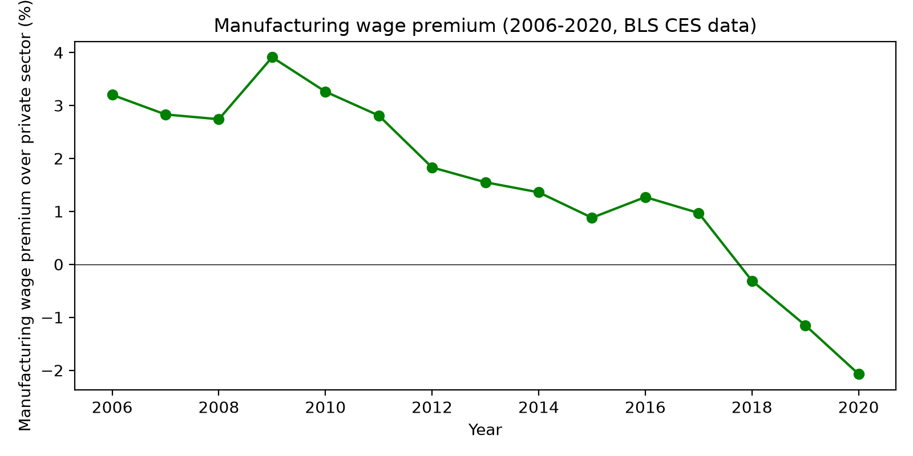

# 初赛提交：问题定义文档（不超过 4 页）

> 本研究旨在为新一轮生产力革命（AI + 机器人自动化）建立可试验、可复盘、可对话的“政策沙盒”，避免重蹈前几次技术大爆发对社会和人民造成的剧烈冲击。我们以 1990—2020 年美国制造业的机器人化浪潮为真实锚点，用多主体仿真打开“企业—政府—劳动者”之间的决策黑箱，并探索何种政策组合能够缓解技术替代对就业与收入分配的负面传导。

# 一、问题与证据

## 1.1 真实问题或需求

我们正站在又一轮生产力革命的入口处。蒸汽机、电力与信息技术的历史反复表明：重大技术跃迁在提升总产出的同时，也会在转型期中撕裂原有就业结构、拉大收入分配与地区鸿沟。一部分劳动者被迅速抛离，而制度干预往往滞后于冲击本身（Acemoglu & Restrepo, 2017, E3）。

本研究的发心，正是希望在本轮自动化浪潮尚未完全定型之前，提前建立一个可试验、可复盘、可对话的“政策沙盒”，避免重蹈前几次生产力大爆发对社会和人民造成的剧烈冲击。我们不想再等到冲击已经发生之后才被动应对，而是想回答：**如果政府、企业、劳动者能够在仿真中反复“预演”未来 30 年，什么样的制度设计可以让技术进步的红利更公平地分配，让被替代者拥有更平缓的过渡路径？**

美国制造业 1990—2020 年的经历为这一发问提供了真实的情境锚点：

- **工业机器人存量**：从 1990 年的约 3.5 万台增长到 2020 年的约 30 万台，机器人密度（每千名制造业工人拥有的机器人数量）从约 2.0 上升到约 24.7（IFR, 2020, E1；作者根据 IFR 披露的关键节点合成的年度序列，详见数据说明）。
- **制造业就业占比**：从 1990 年 12 月的 **15.93%** 下降到 2020 年 12 月的 **8.53%**（FRED `MANEMP` / `PAYEMS`, BLS, E2）。
- **制造业相对工资**：从 2006 年 3 月（BLS 该系列起点）制造业时薪比私人部门整体高 **3.20%**，转为 2020 年 12 月比私人部门整体低 **2.07%**（FRED `CES3000000003` / `CES0500000003`, BLS, E8）。
- **分布效应**：1993—2014 年间，机器人使男性就业下降 **3.7 个百分点**、女性下降 **1.6 个百分点**；使非白人就业下降 **4.5 个百分点**、白人下降 **1.8 个百分点**（Lerch, 2024, E4）。
- **职业流动**：Petrova 等（2024, E5）发现，2000—2016 年间，机器人化显著降低了工人向高薪职业的转换概率，每千名工人增加一台机器人使平均职业价值下降 1.1%—1.7%。

这些事实共同指向一个“黑箱”：**企业和劳动者层面的微观决策（为什么有的企业裁员更多、有的加薪保人？大企业与小企业反应是否不同？政府的失业保险、再培训补贴、机器人税能否改变传导路径？）仍然缺乏可检验的机制解释。**

*图 1：美国制造业就业占比（左轴，%）与机器人密度（右轴，台/千工人）的同步上升与下降。数据来源：FRED `MANEMP`/`PAYEMS`（E2）与 IFR World Robotics 2020（E1）。*

*图 2：制造业平均时薪相对私人部门整体的溢价（%），从 2006 年 +3.2% 转为 2020 年 −2.1%。数据来源：BLS CES（E8）。*

## 1.2 为什么尚未被结构化

现有高质量实证研究（如 Acemoglu & Restrepo, 2017, E3）主要采用**面板回归与工具变量法**，利用地区或行业层面的机器人渗透率外生差异，估计其对就业和工资的“平均处理效应”。这类方法擅长回答“有没有影响”和“影响多大”，但存在两个根本局限：

1. **无法打开“企业”这一关键中介层**——我们不清楚多大比例的大型企业通过投资自动化替代人力，而中小企业是被迫跟随还是另辟蹊径；
2. **无法进行“反事实政策试验”**——无法回答“如果政府当时提高再培训补贴或征收机器人税，结果会怎样？”这一赛题的核心开放性问题。

因此，该问题缺失一个**将宏观冲击、企业异质性决策与微观劳动力反馈纳入统一动态框架的多主体仿真环境**。AI 的介入价值正在于此：它可以用“可复现的仿真”补充“不可重复的历史”。

## 1.3 研究价值与 AI 可提供的观察能力

本项目的科学价值在于用**可复现的仿真补充不可重复的历史**——让 AI Agent 在仿真环境中反复“重演”1990—2020 年的工业化冲击，测试不同政策参数下大、中、小企业的差异化反应，从而发现“何种结构条件会使冲击恶化或缓解”。

AI 在此扮演三类角色：

- **模拟器**：基于真实 FRED/IFR 数据初始化，生成 30 年 × 9 个代表性企业 × 多个随机种子的合成经济面板；
- **探索器**：通过多轮决策空间搜索，寻找稳定优于无干预参照的非平凡政策组合；
- **反例发现器**：系统性地诱发并记录“政策好心办坏事”的失效路径（例如高补贴反而加速自动化替代）。

研究切片聚焦于**“企业规模异质性”**这一枢纽变量：既能锚定真实数据，又能在比赛周期内完成迭代验证。

# 二、环境接口

## 2.1 固定规则

**时间范围**：每轮代表一年，运行 1990—2020 年共 31 轮。

**企业分类**：9 个代表性企业，按员工数划分为三类：

- 小型：$< 50,000$ 人（3 家）
- 中型：$50,000$—$200,000$ 人（3 家）
- 大型：$> 200,000$ 人（3 家）

**生产与需求**：企业 $i$ 在第 $t$ 轮的有效产出为
$$
y_{i,t} = L_{i,t} \cdot A_i \cdot \bigl(1 + a_{i,t} \cdot A_i\bigr),
$$
其中 $L_{i,t}$ 为员工数，$a_{i,t} \in [0,1]$ 为自动化率，$A_i$ 为企业规模异质性生产率（小、中、大分别校准为 1.0、1.3、1.6）。企业必须满足其需求份额：
$$
Y_{i,t}^{req} = s_i \cdot D_t \cdot \gamma,
$$
其中 $s_i$ 为固定市场份额（小、中、大分别为 0.03、0.10、0.30），$D_t$ 为 FRED 制造业工业生产指数 `INDPRO`（E6），$\gamma$ 为需求规模参数（根据 1990 年产出校准为 267,000）。企业收入按有效产出与需求份额的较小值乘以价格水平 $P$ 计算：
$$
R_{i,t} = P \cdot \min\bigl(y_{i,t},\; 1.05 \cdot Y_{i,t}^{req}\bigr).
$$

**成本与利润**：企业利润为
$$
\pi_{i,t} = R_{i,t} - L_{i,t} \cdot w_{i,t} \cdot (1 - s_{gov}) - a_{i,t} \cdot c_t \cdot (1 - r_{gov}) \cdot L_{i,t} - \tau \cdot R_{i,t},
$$
其中 $w_{i,t}$ 为工资，$c_t$ 为机器人单位成本（外生以 3%/年下降），$s_{gov}$ 为政府对中小企业的工资补贴率，$r_{gov}$ 为机器人投资税收抵免率，$\tau = 0.21$ 为企业税率。中小企业与大企业的关键行为差异在于**规划视界**（planning horizon）：大型企业前瞻 3 年，中小企业仅最大化当前利润。

**政府预算**：政府 Agent 的预算约束为
$$
B_t = \sum_i \tau R_{i,t} - U_t - S_t - R_t,
$$
其中 $U_t$ 为失业保险支出，$S_t$ 为中小企业补贴支出，$R_t$ 为机器人税收抵免支出。若 $B_t < -0.05 \sum_i \tau R_{i,t}$ 连续超过 3 轮，则触发“财政崩溃”失败模式。

**外生不可变规则**：机器人成本下降曲线、FRED 需求序列、BLS 初始就业结构、企业分类阈值与市场份额不可由 Agent 改变。

## 2.2 观察 / 行动 / 反馈

**企业 Agent 可观察**：当前轮次的需求指数 $D_t$、机器人成本 $c_t$、自身员工数 $L_{i,t}$、工资 $w_{i,t}$、自动化率 $a_{i,t}$、利润 $\pi_{i,t}$。

**企业 Agent 可行动**：

- 调整自动化率：$\Delta a_{i,t} \in [-0.05, 0.25]$；
- 调整雇佣比例：$\Delta L_{i,t} / L_{i,t} \in [-15\%, +10\%]$；
- 调整工资变化率：$\Delta w_{i,t} / w_{i,t} \in [-3\%, +5\%]$。

**政府 Agent 可行动**：

- 失业保险替代率：$u \in [0, 0.7]$；
- 机器人投资税收抵免率：$r \in [0, 0.4]$；
- 中小企业工资补贴率：$s \in [0, 0.3]$。

**每轮反馈**：企业获得更新后的利润、收入、员工数；政府获得预算余额、失业率、赤字轮次。环境同时输出本轮关键指标变化率。

## 2.3 记录与预算

**记录**：每轮完整保存所有状态变量、行动变量与反馈信号，生成 CSV 日志（约 31 行 × 50 列）；额外保存“决策归因日志”（例如“大型 Agent 因预期 3 年后需求下降而减少招聘”）。

**计算预算**：31 轮 × 9 个企业 Agent × 1 个政府 Agent ≈ 280 次环境交互；单次运行 CPU 耗时 < 30 秒；10 个随机种子的敏感性分析可在笔记本电脑上 5 分钟内完成。

# 三、发现信号与参照

## 3.1 什么算发现

1. **正向发现**：某政策组合在至少 6/10 个随机种子上，使 2020 年制造业失业率比无干预参照低至少 3 个百分点，且工资基尼系数不上升。
2. **异常**：中型企业的自动化率与就业率同时上升（逆“替代”直觉），且该现象在多个种子中稳定。
3. **反例**：提高失业保险替代率或 SME 补贴反而降低总就业（例如企业预期劳动力成本上升而加速自动化）。
4. **稳定负结果**：在所有参数扫描中，低技能工人工资均无法恢复到冲击前 90% 水平。
5. **失败模式**：政府预算连续 3 轮赤字超过税收收入 5% 导致模型崩溃；或仿真因数值溢出提前终止。

## 3.2 平凡解 / 随机 / 无干预

- **无干预参照**（free_market）：政府参数固定为 $u=0.2, r=0, s=0$，企业仅按利润最大化行动。
- **单一政策 baseline**：政府仅调整单一工具（如仅调失业保险），用于评估多维政策组合是否产生协同效应。
- **历史参照**：将仿真输出的 1990—2020 年就业序列与 FRED/BLS 真实序列进行 RMSE 比较，若 RMSE 在合理阈值内则证明模型校准有效。
- **随机参照**：企业 Agent 的行动在可行域内均匀随机抽样，用于检查环境是否对理性决策敏感。

**超越参照的判定标准**：在相同随机种子下，探索策略在失业率、平均工资、工资基尼系数三个指标的均值上同时优于无干预参照与随机参照（单侧 t 检验，$p < 0.05$）。

## 3.3 最低成功与失败标准

- **最低成功**：① 仿真稳定运行 31 轮且无数值溢出；② 至少识别 1 个政策组合在 ≥6/10 个种子上显著优于无干预参照；③ 能清晰解释“为什么该组合有效”的机制路径（如“补贴中小企业使其保留岗位，从而减缓失业率传导至消费端”）。
- **明确失败**：① 运行中因逻辑死锁或数值爆炸提前终止；② 所有政策组合与无干预结果无显著差异（环境不敏感）；③ 历史校准偏差极大（RMSE 超过经验阈值的 2 倍）。
- **失败后更新路径**：若失败，优先尝试 ① 降维——取消大/小企业前瞻差异，检验是否因复杂度导致；② 切换证据——若历史校准失败，则放弃精确拟合，转为参数空间探索，并明确标注为理论推演。

# 四、最小验证计划

## 4.1 一次试跑怎么做

我们已完成一次最小试跑：在三个政策场景（free_market、moderate、aggressive）下各运行 3 个随机种子，共 9 次仿真。

**目标**：检验环境能否产生有意义的分化结果，并初步观察政策工具对就业与自动化的影响。

**输入**：以 1990 年 BLS 制造业就业数据初始化 9 个企业 Agent；以 FRED `INDPRO` 序列作为外生需求；以 IFR 披露的机器人存量关键节点合成外生机器人成本曲线。

**步骤**：① 运行 `python src/process_data.py` 处理 FRED 数据；② 运行 `python src/run_simulation.py` 执行 3×3 场景比较；③ 运行 `python src/analysis.py` 生成可视化。

**输出与关键证据**：结果保存于 `project/results/scenario_comparison.csv`。核心发现（seed=42）见下表：

| 场景 | 2020 年就业（千人） | 2020 年失业率 | 2020 年平均自动化率 | 2020 年政府预算 |
|---|---:|---:|---:|---:|
| free_market | 10,510 | 39.6% | 1.000 | 8.41×10⁷ |
| moderate | 10,535 | 39.4% | 0.983 | 7.71×10⁷ |
| aggressive | 10,532 | 39.5% | 0.983 | 7.01×10⁷ |

*表 1：最小试跑结果。就业=9 个代表性企业之和；失业率=(基准劳动力−就业)/基准劳动力。该结果展示了自动化替代就业的方向，但不同政策场景的差异尚未显著，提示需要进一步校准政策传导弹性与机器人成本下降速度。*

*图 3：三场景下的就业、自动化率、失业率与工资基尼系数轨迹。数据来源：本研究 Mesa 仿真输出。*

*图 4：小型、中型、大型代表性企业的就业与自动化率分化。大型企业更早、更快达到高自动化率，与文献中“资本密集型大企业更易采用自动化”的观察一致（E3, E4）。*

## 4.2 主要风险与失败路径

1. **数据分层缺失**：BLS 分规模就业数据与 IFR 行业分类不完全匹配。→ 预案：使用 NBER-CES 制造业数据库作为替代；若仍无法匹配，则在报告中明确“分规模数据由行业汇总数据按规模分布比例合成”的假设。
2. **参数校准偏差**：当前试跑显示失业率（约 40%）高于真实制造业失业率，说明机器人成本下降速度与劳动力替代弹性仍需校准。→ 预案：将机器人成本下降率、生产率参数、价格水平作为敏感性分析对象，用 RMSE 选择最小化历史偏差的参数组合。
3. **工具链冲突**：Mesa 2.4.0 与 numpy 版本可能存在兼容性风险。→ 预案：已锁定 `requirements.txt`，并可用纯 Python 类实现替代。
4. **失败后定位**：若某次仿真崩溃，记录最后轮次所有变量值，并执行“二分法”定位——禁用部分决策逻辑，观察哪部分导致溢出。

## 4.3 复现与开源计划

- **数据来源**：FRED `MANEMP`、`PAYEMS`、`INDPRO`、`AWHMAN`、`CES3000000003`、`CES0500000003`（均已下载至 `data/raw/`）；IFR World Robotics 2020 Executive Summary（`AI4S/E1 IFR_WR_2020_Executive_Summary.pdf`）。
- **依赖工具**：Python 3.10+、Mesa 2.4.0、numpy、pandas、matplotlib、seaborn。
- **复现流程**：执行 `python src/run_simulation.py --scenario moderate --seeds 10` 即可复现；代码仓库包含 `requirements.txt`、`src/model.py`、`src/run_simulation.py`、`src/analysis.py`。
- **开源计划**：初赛结束后在 GitHub 公开（MIT 协议），仿真日志、决策归因日志与核心可视化图作为补充材料发布。

# 五、团队介绍

（此处保留模板中的团队信息占位，由参赛团队按实际成员填写。）

# 附录：证据台账（供评委核验，不计入 4 页正文）

| 编号 | 状态 | 核心主张 | 来源 | 与项目关系 | 获取路径 |
|---|---|---|---|---|---|
| E1 | ✅ 已核验 | 1990—2020 年美国工业机器人存量从约 3.5 万台增至约 30 万台；机器人密度从 2.0 升至 24.7/千工人。 | IFR World Robotics 2020 Executive Summary | 环境初始化、外生机器人存量曲线 | `AI4S/E1 IFR_WR_2020_Executive_Summary.pdf` |
| E2 | ✅ 已核验 | 1990—2020 年美国制造业就业占比从 15.93% 降至 8.53%。 | FRED `MANEMP` / `PAYEMS`（BLS） | 真实问题存在、历史参照锚点 | `project/data/raw/MANEMP.csv`, `PAYEMS.csv` |
| E3 | ✅ 已核验 | 1993—2007 年美国机器人存量增长四倍；每千工人多一台机器人使就业人口比下降 0.18—0.34 个百分点、工资下降 0.25—0.5%。 | Acemoglu & Restrepo (2017), NBER WP 23285 | 方法论缺口、效应弹性基准 | `AI4S/E3 robots_and_jobs_nber23285.pdf` |
| E4 | ✅ 已核验（总结页） | 1993—2014 年机器人使男性就业下降 3.7 pp、女性下降 1.6 pp；非白人下降 4.5 pp、白人下降 1.8 pp。 | Lerch (2024), *American Economic Journal: Macroeconomics* | 分布效应、真实问题强化 | https://www.aeaweb.org/research/automation-employment-gaps-us |
| E5 | ✅ 已核验 | 2000—2016 年机器人化降低工人向高薪职业转换概率；每千工人多一台机器人使职业价值下降 1.1%—1.7%。 | Petrova et al. (2024), NBER WP 32655 | 真实问题存在、机制补充 | `AI4S/E5 Petrova_Schubert_Taska_Yildirim_NBER_32655.pdf` |
| E6 | ✅ 已核验 | FRED `INDPRO` 制造业工业生产指数 1990—2020；`AWHMAN` 制造业平均每周工时。 | Federal Reserve Bank of St. Louis | 外生需求、环境补充数据 | `project/data/raw/INDPRO.csv`, `AWHMAN.csv` |
| E7 | ⏳ 待核验 | IFR 国家—行业—年度完整面板数据（用于更精确的行业/地区异质性）。 | IFR（付费） | 环境后备方案 | 需机构购买或申请 |
| E8 | ✅ 已核验 | 2006—2020 年制造业时薪相对私人部门从 +3.2% 降至 −2.1%。 | FRED `CES3000000003` / `CES0500000003`（BLS CES） | Agent 状态校准、工资参照 | `project/data/raw/CES3000000003.csv`, `CES0500000003.csv` |

*注：本研究使用的“IFR 年度机器人存量”序列基于 IFR Executive Summary 披露的关键节点（1993 年、2007 年、2019 年）线性插值合成，并在台账中明确标注为合成数据。若比赛提交前获得完整 IFR 面板，将替换为官方序列。*
