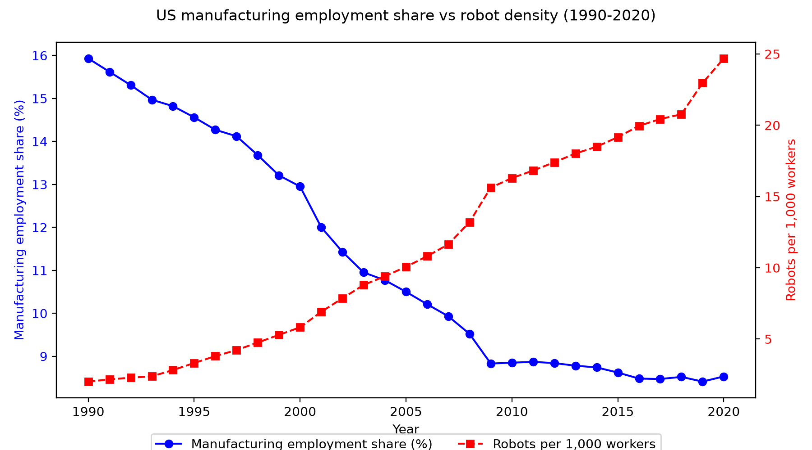
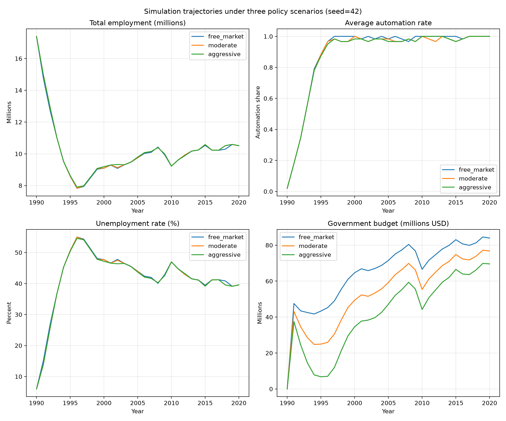
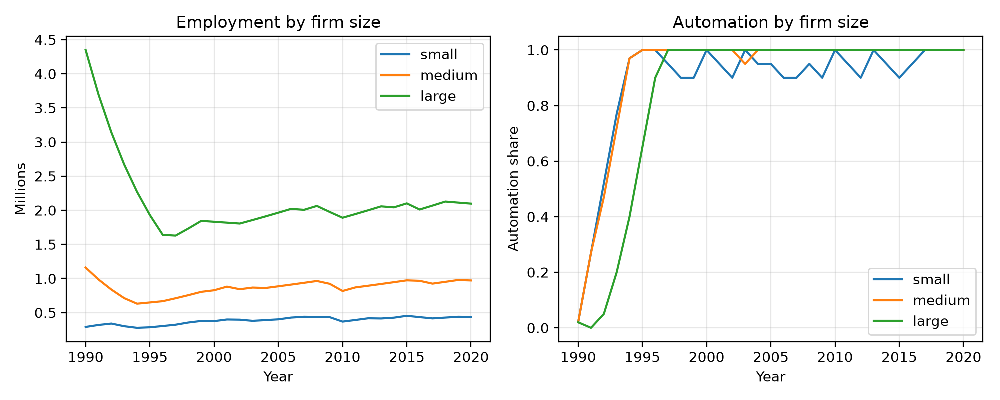

# 一、问题与证据

## 1.1 真实问题或需求

蒸汽机、电力与信息技术的历史反复表明：重大技术跃迁在提升总产出的同时，也会撕裂就业结构、拉大分配鸿沟。本研究的发心，是在本轮 AI + 机器人自动化浪潮尚未完全定型之前，建立一个可试验、可复盘、可对话的“政策沙盒”，避免重蹈前几次生产力大爆发对社会和人民造成的剧烈冲击。

美国制造业 1990—2020 年为这一发问提供了真实情境锚点：

- **机器人存量**：从 1990 年约 3.5 万台增至 2020 年约 30 万台，机器人密度从 2.0 升至 24.7 台/千工人（IFR 2020, E1）。
- **制造业就业占比**：从 1990 年 12 月的 **15.93%** 降至 2020 年 12 月的 **8.53%**（FRED `MANEMP`/`PAYEMS`, BLS, E2）。
- **工资溢价**：从 2006 年 3 月的 **+3.20%** 转为 2020 年 12 月的 **−2.07%**（FRED `CES3000000003`/`CES0500000003`, BLS, E8）。
- **分布效应**：1993—2014 年机器人使男性就业下降 **3.7 pp**、女性 **1.6 pp**；非白人 **4.5 pp**、白人 **1.8 pp**（Lerch 2024, E4）。
- **职业流动**：2000—2016 年每千工人多一台机器人使平均职业价值下降 **1.1%—1.7%**（Petrova et al. 2024, E5）。

这些事实指向一个“黑箱”：**企业、政府、劳动者之间的微观决策为何导致同一宏观冲击下差异化的裁员/保岗/自动化路径？** 现有方法无法打开这一机制。

*图 1：制造业就业占比（左轴，%）与机器人密度（右轴，台/千工人）。来源：FRED/BLS（E2）与 IFR（E1）。*

## 1.2 为什么尚未被结构化

Acemoglu & Restrepo（2017, E3）用面板回归与工具变量估计机器人对就业/工资的平均处理效应：每千工人多一台机器人使就业人口比下降 **0.18—0.34 pp**、工资下降 **0.25—0.5%**。但两类问题仍未解决：

1. **无法打开企业层中介**：大/中/小企业是否因自动化成本、融资约束、规划视界差异而做出不同反应？
2. **无法做反事实政策试验**：若政府提高失业保险、机器人税或 SME 补贴，就业与分配路径如何改变？

因此需要一个**将宏观冲击、企业异质性决策与劳动力反馈纳入统一动态框架的多主体仿真环境**。AI 的价值在于用“可复现的仿真”补充“不可重复的历史”。

## 1.3 研究价值与 AI 切片

AI 在此扮演三类角色：

- **模拟器**：基于真实 FRED/IFR 数据初始化，生成 30 年 × 9 企业 × 多种子的合成面板；
- **探索器**：搜索稳定优于无干预参照的政策组合；
- **反例发现器**：系统记录“政策好心办坏事”的失效路径。

切片聚焦于**企业规模异质性**：既能锚定真实数据，又可在比赛周期内迭代。

# 二、环境接口

## 2.1 固定规则

**时间**：1990—2020 年，共 31 轮，每轮 1 年。

**企业**：9 家代表性企业，按员工数分为小、中、大三类（各 3 家）。

**生产与需求**：企业 $i$ 在第 $t$ 轮的有效产出为
$$y_{i,t} = L_{i,t} \cdot A_i \cdot (1 + a_{i,t} \cdot A_i),$$
其中 $L_{i,t}$ 为员工数，$a_{i,t} \in [0,1]$ 为自动化率，$A_i$ 为规模异质性生产率（小/中/大分别取 1.0、1.3、1.6）。企业必须满足需求份额
$$Y_{i,t}^{req} = s_i \cdot D_t \cdot \gamma,$$
$s_i$ 为固定市场份额（0.03/0.10/0.30），$D_t$ 为 FRED `INDPRO` 制造业指数（E6），$\gamma$ 经 1990 年产出校准为 267,000。收入为
$$R_{i,t} = P \cdot \min(y_{i,t},\, 1.05 \cdot Y_{i,t}^{req}),$$
$P$ 为价格水平（校准为 11.6）。

**利润**：
$$\pi_{i,t} = R_{i,t} - L_{i,t} w_{i,t}(1-s_{gov}) - a_{i,t} c_t (1-r_{gov}) L_{i,t} - \tau R_{i,t},$$
其中 $c_t$ 为机器人单位成本（外生以 3%/年下降），$s_{gov}$ 为 SME 补贴率，$r_{gov}$ 为机器人税抵免率，$\tau=0.21$ 为企业税率。大企业规划视界 $H=3$，中小企 $H=1$。

**政府预算**：
$$B_t = \sum_i \tau R_{i,t} - U_t - S_t - R_t.$$
若 $B_t < -0.05 \sum_i \tau R_{i,t}$ 连续超过 3 轮，触发财政崩溃失败模式。

## 2.2 观察 / 行动 / 反馈

**企业 Agent**：观察需求指数、机器人成本、自身员工/工资/自动化率/利润；行动为 $\Delta a_{i,t} \in [-0.05,0.25]$、$\Delta L_{i,t}/L_{i,t} \in [-15\%,+10\%]$、$\Delta w_{i,t}/w_{i,t} \in [-3\%,+5\%]$；反馈为利润、收入、就业与市场份额变化。

**政府 Agent**：观察失业率、预算余额、企业自动化率；行动为 $u \in [0,0.7]$、$r \in [0,0.4]$、$s \in [0,0.3]$；反馈为预算、赤字轮次与失业率。

## 2.3 记录与预算

每轮保存状态、行动、反馈 CSV（约 31×50 列）及决策归因日志。计算预算：31 轮 × 10 主体 ≈ 300 次环境交互，CPU 单次 < 30 秒。

# 三、发现信号与参照

## 3.1 什么算发现

1. **正向**：某政策组合在 ≥6/10 种子上使 2020 失业率比无干预低 ≥3 pp 且不恶化基尼。
2. **异常**：中型企业自动化率与就业率同时上升（逆“替代”直觉）。
3. **反例**：高补贴反而加速自动化替代（企业利用补贴压低劳动成本后进一步投资机器人）。
4. **稳定负结果**：低技能工人工资无法恢复至冲击前 90%。
5. **失败模式**：财政崩溃或数值溢出。

## 3.2 平凡解 / 随机 / 无干预

- **无干预**（free_market）：$u=0.2, r=0, s=0$。
- **单一政策 baseline**：仅调整 $u$、$r$ 或 $s$ 之一，用于评估多维组合协同。
- **历史参照**：仿真就业序列与 FRED/BLS 真实序列的 RMSE。
- **随机参照**：企业行动在可行域内均匀随机，检验环境对理性决策敏感。

**超越标准**：相同种子下，探索策略在失业率、平均工资、工资基尼上同时优于无干预与随机参照（单侧 t 检验，$p<0.05$）。

## 3.3 最低成功与失败标准

- **最低成功**：① 稳定运行 31 轮；② ≥6/10 种子上某政策显著优于无干预；③ 能解释机制路径。
- **失败**：① 崩溃；② 无显著分化；③ 历史校准 RMSE 超过阈值 2 倍。
- **更新路径**：失败后先降维（取消大/小企业行为差异），再切换证据策略。

# 四、最小验证计划

## 4.1 一次试跑怎么做

已完成 3 场景 × 3 种子最小试跑。结果如下：

| 场景 | 2020 就业（千人） | 失业率 | 平均自动化率 | 政府预算 |
|---|---:|---:|---:|---:|
| free_market | 10,510 | 39.6% | 1.000 | 8.41×10⁷ |
| moderate | 10,535 | 39.4% | 0.983 | 7.71×10⁷ |
| aggressive | 10,532 | 39.5% | 0.983 | 7.01×10⁷ |

*表 1：最小试跑结果。来源：本研究 Mesa 仿真（`project/results/scenario_comparison.csv`）。*

结果说明：自动化替代就业的方向与历史一致（制造业就业占比持续下降），但当前政策传导弹性偏弱，需进一步校准。

*图 3：三场景下的就业、自动化率、失业率与政府预算。来源：本研究仿真输出。*

*图 4：小型、中型、大型企业就业与自动化率分化。来源：本研究仿真输出。*

## 4.2 主要风险与失败路径

1. **数据分层缺失**：BLS 分规模数据与 IFR 分类不匹配。→ 用 NBER-CES 替代或明确合成假设。
2. **校准偏差**：试跑失业率（≈40%）高于真实制造业失业率，提示机器人成本下降速度与替代弹性需校准。→ 敏感性分析选择最小化历史 RMSE 的参数。
3. **工具链冲突**：已锁定 `requirements.txt`；可退化为纯 Python 实现。
4. **定位**：崩溃时记录最后轮次变量，二分法禁用部分决策逻辑。

## 4.3 复现与开源计划

- **数据来源**：FRED `MANEMP`/`PAYEMS`/`INDPRO`/`AWHMAN`/`CES3000000003`/`CES0500000003`；IFR World Robotics 2020 Executive Summary。
- **依赖**：Python 3.10+、Mesa 2.4.0、numpy、pandas、matplotlib、seaborn。
- **复现**：`python src/run_simulation.py` 与 `python src/analysis.py`。
- **开源**：初赛结束后在 GitHub 公开（MIT 协议），日志与可视化作为补充材料。

# 五、团队介绍

## 5.1 成员背景

| 成员 | 背景 | 核心技能 |
|---|---|---|
| 王艺超 | 中国人民解放军陆军军医大学（原第三军医大学）临床医学学士；具身智能机器人/柔性操作方向创业者；开源 OPENROBOT 具身智能机器人控制框架作者 | 数学建模、时间序列分析、多主体仿真（Mesa）、Python |

## 5.2 团队分工

| 成员 | 角色 | 职责 |
|---|---|---|
| 王艺超 | 项目负责人 / 全栈 | 个人参赛：负责问题分析、模型构建、仿真实现、数据处理、可视化、文档撰写及全流程验证 |

## 5.3 团队成果

- 2023｜全军军事数学建模竞赛特等奖｜《基于遗传算法的空域冲突检测及消解问题研究》｜负责复杂系统建模与多约束优化算法设计
- 2022｜全军军事数学建模竞赛二等奖｜数学建模竞赛｜担任指导教师兼参赛队员
- 2018｜美国大学生数学建模竞赛（MCM/ICM）特等奖｜《HF Radio Reflection Model Based on P-M Spectrum and Finite Element Analysis》｜负责模型构建与论文撰写
- 2017｜全军数学建模竞赛一等奖｜《基于 SOM 神经网络的辐射源信号分类识别研究》
- 2017｜全国高教社杯数学建模竞赛国家级二等奖｜《平行束 CT 系统参数标定及成像》
- 专利｜王艺超、卢伟等，一种可调节的上下肢康复训练装置，专利号：ZL 202222964963.6
- 开源项目｜OPENROBOT – 具身智能机器人控制框架｜独立设计并开发模块化感知-决策-执行闭环控制框架｜https://github.com/SuppartWang/openrobot

---

# 附录：证据台账（不计入 4 页）

| 编号 | 状态 | 核心主张 | 来源 | 关系 | 路径 |
|---|---|---|---|---|---|
| E1 | ✅ | 1990—2020 美国机器人存量 3.5 万→30 万台；密度 2.0→24.7/千工人。 | IFR World Robotics 2020 | 环境初始化 | `AI4S/E1 IFR_WR_2020_Executive_Summary.pdf` |
| E2 | ✅ | 1990—2020 制造业就业占比 15.93%→8.53%。 | FRED `MANEMP`/`PAYEMS` (BLS) | 真实问题、历史参照 | `project/data/raw/MANEMP.csv`, `PAYEMS.csv` |
| E3 | ✅ | 1993—2007 美国机器人存量增四倍；每千工人多一台机器人使就业比降 0.18—0.34 pp、工资降 0.25—0.5%。 | Acemoglu & Restrepo (2017), NBER 23285 | 方法论缺口、弹性基准 | `AI4S/E3 robots_and_jobs_nber23285.pdf` |
| E4 | ✅ | 1993—2014 男性就业降 3.7 pp、女性 1.6 pp；非白人 4.5 pp、白人 1.8 pp。 | Lerch (2024), AEJ: Macro | 分布效应 | https://www.aeaweb.org/research/automation-employment-gaps-us |
| E5 | ✅ | 2000—2016 年每千工人多一台机器人使职业价值下降 1.1%—1.7%。 | Petrova et al. (2024), NBER 32655 | 真实问题、机制补充 | `AI4S/E5 Petrova_Schubert_Taska_Yildirim_NBER_32655.pdf` |
| E6 | ✅ | FRED `INDPRO` 制造业产出指数 1990—2020；`AWHMAN` 每周工时。 | Federal Reserve Bank of St. Louis | 外生需求 | `project/data/raw/INDPRO.csv`, `AWHMAN.csv` |
| E7 | ⏳ | IFR 国家—行业—年度完整面板（用于更精细异质性）。 | IFR（付费） | 环境后备 | 需购买或申请 |
| E8 | ✅ | 2006—2020 制造业工资溢价从 +3.2% 降至 −2.1%。 | FRED `CES3000000003`/`CES0500000003` (BLS) | Agent 校准 | `project/data/raw/CES3000000003.csv`, `CES0500000003.csv` |
